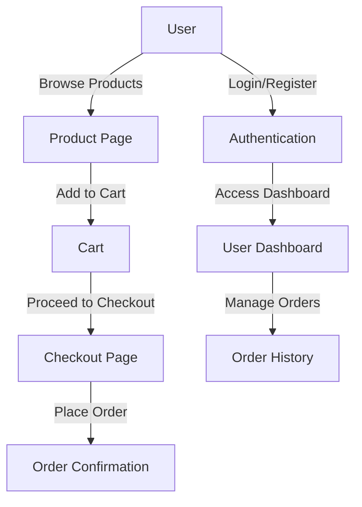

# 🌿 Greenkaufen: Flask E-commerce Website

**Greenkaufen** is a modern, eco-friendly e-commerce platform built with Flask. It provides a seamless shopping experience while promoting sustainability. This project demonstrates the integration of Flask with essential e-commerce features, making it a robust and scalable solution for online retail.

---

## 🚀 Features
- **User-Friendly Interface**
- **Product Management**: Add, edit, and display products.
- **Secure Authentication**: User registration, login, and password hashing.
- **Shopping Cart**: Add, remove, and manage items.
- **Order Management**: Track and view orders.
- **Admin Dashboard**: Manage users, products, and orders.
- **Responsive Design**: Mobile-friendly.

---

## 🔧 Technologies Used
- **Backend**: Flask, Flask-SQLAlchemy, Flask-WTF
- **Frontend**: HTML5, CSS3, JavaScript, Bootstrap
- **Database**: SQLite/PostgreSQL
- **Authentication**: Flask-Login, Flask-Bcrypt
- **Deployment**: Docker, Gunicorn, Nginx

---

## 📂 Project Structure
```plaintext
Directory structure:
└── SanthoshkumarSundararaj-E-commerce-greenkaufen/
    ├── README.md
    ├── Dockerfile
    ├── app.py
    ├── babel.cfg
    ├── blog.json
    ├── config.py
    ├── database.py
    ├── exclusive_products.json
    ├── firebase_helper.py
    ├── forms.py
    ├── messages.pot
    ├── models.py
    ├── products.json
    ├── requirements.txt
    ├── serviceAccountKey.json
    ├── flask_session/
    │   └── .DS_Store
    ├── images/
    ├── instance/
    │   └── site.db
    ├── static/
    │   ├── .DS_Store
    │   ├── css/
    │   │   ├── animate.css
    │   │   ├── font.awesome.css
    │   │   ├── magnific-popup.css
    │   │   ├── plugins.css
    │   │   ├── slick.css
    │   │   ├── slinky.menu.css
    │   │   ├── style.css
    │   │   └── extra/
    │   │       ├── default.css
    │   │       └── style.css
    │   ├── fonts/
    │   │   
    │   ├── img/
    │   │   
    │   └── js/
    ├── templates/
    │   ├── about.html
    │   ├── blog-details.html
    │   ├── blog.html
    │   ├── bulk_enquiry.html
    │   ├── bulk_thanks.html
    │   ├── cart.html
    │   ├── checkout.html
    │   ├── contact.html
    │   ├── faq.html
    │   ├── impressum.html
    │   ├── index-2.html
    │   ├── index.html
    │   ├── login.html
    │   ├── my-account.html
    │   ├── privacy.html
    │   ├── product-details.html
    │   ├── section.html
    │   ├── services.html
    │   ├── shop.html
    │   ├── terms.html
    │   ├── wishlist.html
    │   └── .DS_Store
    └── translations/
        └── de/
            └── LC_MESSAGES/
                ├── messages.mo
                └── messages.po

```

---

## 🥇 Code Examples

### User Authentication (Login Route)
```python
from flask import Flask, render_template, request, redirect, url_for, flash
from flask_login import LoginManager, login_user, logout_user, login_required
from models import User

app = Flask(__name__)
login_manager = LoginManager(app)

@login_manager.user_loader
def load_user(user_id):
    return User.query.get(int(user_id))

@app.route('/login', methods=['GET', 'POST'])
def login():
    if request.method == 'POST':
        email = request.form['email']
        password = request.form['password']
        user = User.query.filter_by(email=email).first()
        if user and user.check_password(password):
            login_user(user)
            flash('Login successful!', 'success')
            return redirect(url_for('dashboard'))
        flash('Invalid credentials', 'danger')
    return render_template('login.html')
```

### Add to Cart Functionality
```python
@app.route('/add_to_cart/<int:product_id>', methods=['POST'])
@login_required
def add_to_cart(product_id):
    product = Product.query.get_or_404(product_id)
    quantity = int(request.form['quantity'])
    cart_item = Cart(user_id=current_user.id, product_id=product.id, quantity=quantity)
    db.session.add(cart_item)
    db.session.commit()
    flash(f'Added {product.name} to your cart!', 'success')
    return redirect(url_for('shop'))
```

### Product Model Example
```python
from app import db

class Product(db.Model):
    id = db.Column(db.Integer, primary_key=True)
    name = db.Column(db.String(100), nullable=False)
    price = db.Column(db.Float, nullable=False)
    description = db.Column(db.Text, nullable=True)
    image_url = db.Column(db.String(200), nullable=True)

    def __repr__(self):
        return f'<Product {self.name}>'
```

---

## 🔧 Installation and Setup

### Prerequisites
- Python 3.9+
- Flask 2.x
- A virtual environment tool (e.g., venv or virtualenv)

### Steps
1. Clone the repository:
   ```bash
   git clone https://github.com/SanthoshkumarSundararaj/flask_greenkaufen.git
   cd greenkaufen
   ```
2. Set up a virtual environment:
   ```bash
   python3 -m venv venv
   source venv/bin/activate  # On Windows: venv\Scripts\activate
   ```
3. Install dependencies:
   ```bash
   pip install -r requirements.txt
   ```
4. Set up the database:
   ```bash
   flask db init
   flask db migrate
   flask db upgrade
   ```
5. Run the application:
   ```bash
   flask run
   ```

---

## 🔄 Application Flowchart


---

## Image demo


## 📄 Sponsor
This project is sponsored by Greenkaufen GmbH

---

## ✨ Acknowledgments
Special thanks to the open-source community for providing amazing tools and libraries that power **Greenkaufen**.
